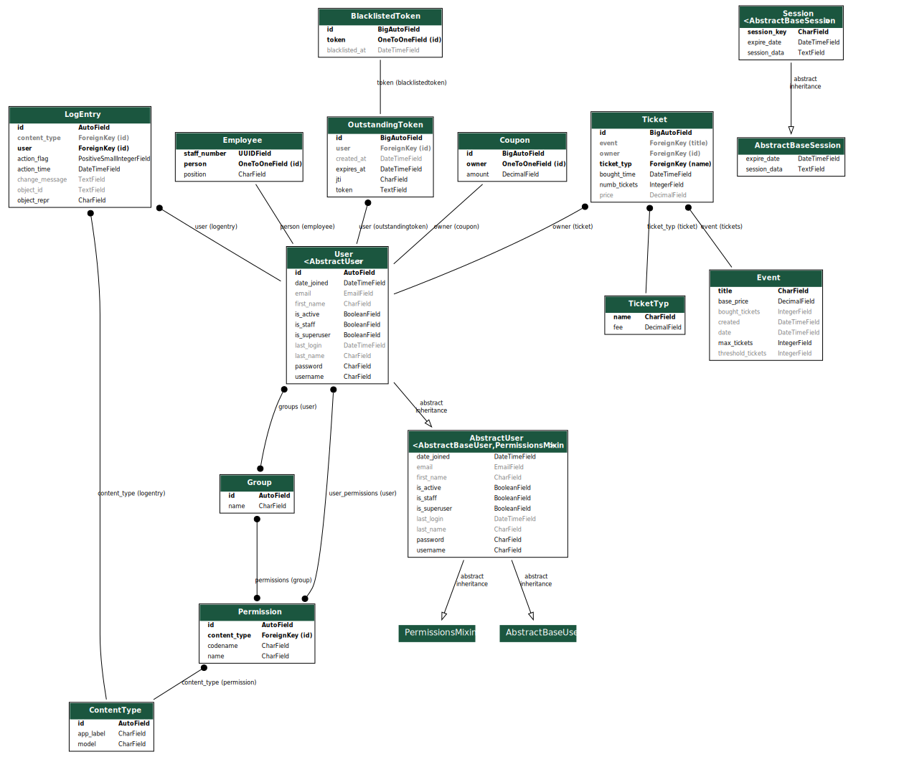
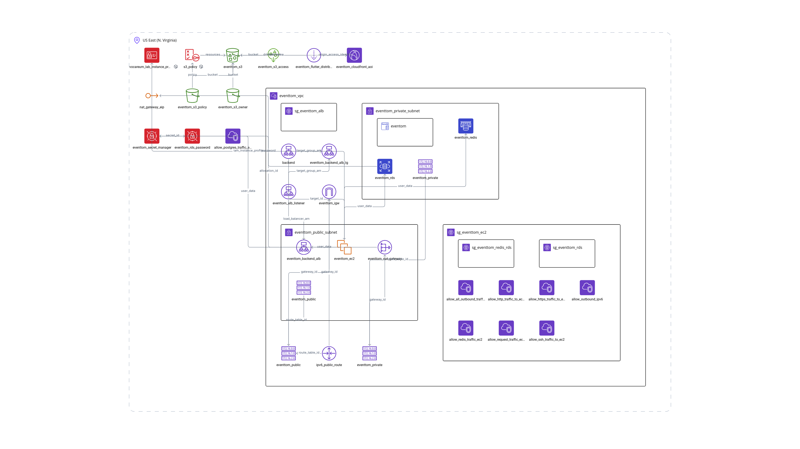

# EvenTom Semesterprojekt Softwarearchitektur und Qualitätssicherung WS 2024/2025

[](https://sonarcloud.io/summary/new_code?id=Flashwar_EventTom)

Dieses Repository stellt das GitHub-Mirror-Repo für das Eventmanagement-Projekt EventTom dar, das nebenbei auf GitLab gehostet wird. Das Projekt wurde im Rahmen des Semesters "Softwarearchitektur und Qualitätssicherung" im Wintersemester 2024/2025 entwickelt.

## Projektbeschreibung

Das Projekt umfasst eine Eventmanagement-Webseite, die es Nutzern ermöglicht, Tickets für verschiedene Events zu kaufen und dabei personalisierte Coupons zu erhalten. Darüber hinaus gibt es unterschiedliche Rollen, die verschiedene Funktionen innerhalb der Webseite haben:

- **Kunde**: Kann ein oder mehrere Tickets kaufen und personalisierte Coupons erhalten.
- **Employee**: Hat bestimmte Berechtigungen für die Verwaltung von Events.
- **EventManager**: Wird benachrichtigt, wenn Tickets für ein Event gekauft wurden.
- **EventCreator**: Kann neue Events erstellen. Sobald ein neues Event erstellt wird, werden alle aktiven Nutzer benachrichtigt.

### Benachrichtigungsfunktionen:
- **EventCreator**: Alle aktiven Nutzer werden benachrichtigt, wenn ein neues Event erstellt wird.
- **Ticketkauf**: Alle aktiven EventManager werden benachrichtigt, wenn Tickets für ein Event gekauft werden, und erhalten die Information, wie viele Tickets für welches Event gekauft wurden.

## Verwendete Technologien

- **Frontend**: Flutter
- **Backend**: Django
- **API**: Restful Framework mit JWT (JSON Web Tokens) für Authentifizierung
- **Websockets**: Für Echtzeit-Kommunikation
- **Datenbank**: PostgreSQL (DBMS)
- **Redis**: Wird für Websockets (Channels) verwendet, um Echtzeit-Benachrichtigungen zu ermöglichen
- **Pattern**: Dependency Injection, Observer, Decorator und Singelton

## Model Schema und Cloud Infrastructure

### Model Schema

### Cloud Infrastructure



## Installation

### Backend-Setup mit Poetry

1. **Repository klonen**:
   ```bash
   git clone https://github.com/Flashwar/EventTom.git
   
   cd EventTom
   ```

2. **Poetry installieren**:
   ```bash
   curl -sSL https://install.python-poetry.org | python3 -
   ```
   Weitere Details findest du in der [offiziellen Dokumentation](https://python-poetry.org/docs/#installation).

3. **Abhängigkeiten installieren**:
   ```bash
   poetry install
   ```

4. **Projektumgebung aktivieren**:
   ```bash
   poetry shell
   ```

5. **Django-Server starten**:
   Erstelle oder passe die `.env`-Datei an und starte den Server:
   ```bash
   python manage.py runserver
   ```
   Der Server ist anschließend unter `http://127.0.0.1:8000` verfügbar.

### Backend-Setup mit virtueller Umgebung (venv)
1. **Repository klonen**:
   ```bash
   git clone https://github.com/Flashwar/EventTom.git
  
   cd EventTom
   ```

2. **Virtuelle Umgebung erstellen und aktivieren**:
   ```bash
   python -m venv venv
   source venv/bin/activate   # Windows: venv\Scripts\activate
   ```

3. **Abhängigkeiten installieren**:
   ```bash
   pip install -r requirements.txt
   ```

4. **.env-Datei erstellen und konfigurieren**:
   Beispiel-Inhalt:
   ```plaintext
   SECRET_KEY=<Django-Secret-Key>
   DATABASE_URL=''
   WEBSITE_HOSTNAME='127.0.0.1'
   REDIS_SERVERIP='127.0.0.1'
   ```
   **Hinweis**: Den Django-Secret-Key kannst du [hier generieren](https://djecrety.ir/).

5. **Alternative Einstellungen (SQLite, In-Memory-Channels)**:
   Falls PostgreSQL oder Redis nicht verwendet werden soll, können folgende Anpassungen in `settings.py` vorgenommen werden:
   ```
   CHANNEL_LAYERS = {
       "default": {
           "BACKEND": "channels.layers.InMemoryChannelLayer"
       }
   }

   DATABASES = {
       'default': {
           'ENGINE': 'django.db.backends.sqlite3',
           'NAME': BASE_DIR / "db.sqlite3",
       }
   }
   ```

6. **Django-Server starten**:
   ```bash
   python manage.py runserver
   ```
   Der Server ist unter `http://127.0.0.1:8000` verfügbar.

---

## Testen des Projekts

### Tests ausführen (Poetry):
1. Aktivieren der Poetry-Umgebung:
   ```bash
   poetry shell
   ```
2. Tests starten:
   ```bash
   python manage.py makemigrations
   
   python manage.py test backend.tests
   ```

### Tests ausführen (venv):
1. Virtuelle Umgebung aktivieren:
   ```bash
   source venv/bin/activate   # Windows: venv\Scripts\activate
   ```
2. Tests starten:
   ```bash
   python manage.py makemigrations
   
   python manage.py test backend.tests
   ```

---

## Installation in einem Docker-Container

EvenTom unterstützt Docker-basierte Deployments. Führe folgenden Befehl aus:
```bash
  docker-compose up --build
```
Dabei werden drei Container gestartet:
1. **Redis**: Für Echtzeit-Kommunikation
2. **PostgreSQL**: Für Datenbankverwaltung
3. **Backend**: Für die API und Geschäftslogik

Das Backend ist unter `http://127.0.0.1:8000` erreichbar.

### Test ausführen Docker
 
1. Container-ID  ermitteln:

Der Befehl zeigt eine Liste aller laufenden Container. Notieren Sie sich die Container-ID des Backend-Containers.
```bash
   docker ps
```

2. Container verbinden:

Ersetzen Sie <containerid> mit der ID des Backend-Containers.
```bash
  docker exec -it <containerid> sh
```
3. Tests ausführen

```bash
  python manage.py makemigrations

  python3 manage.py test backend.tests
```